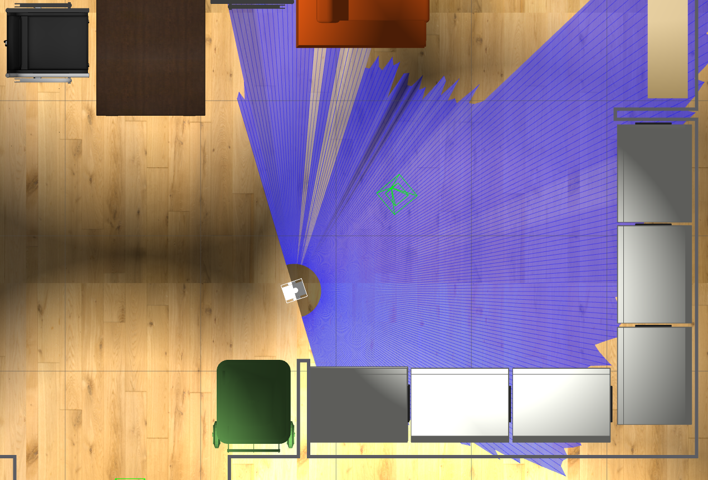
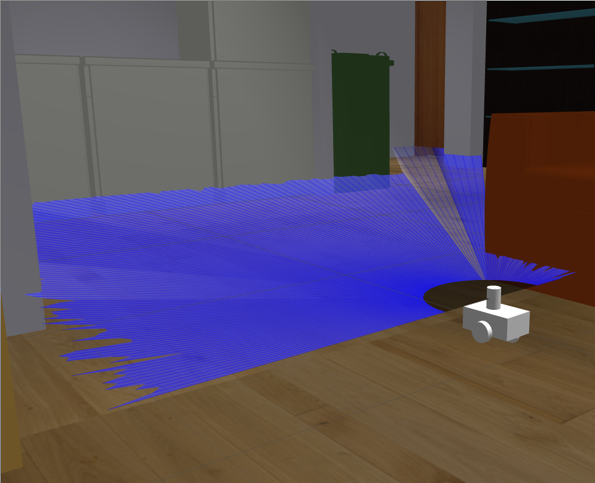

# ScanBot
A ROS based room scanning robot.  
My master's thesis.    
  
  

For more information check out [this article](https://tomaszu.com/posts/scanbot/scanbot/).


```
resource sources:
gazebo 3d models https://data.nvision2.eecs.yorku.ca/3DGEMS/
3dxo ArrowayTextures
```

```
Setup A Catkin Workspace

These instructions require the use of the catkin build system.

If you do not have a catkin workspace setup, try the following commands:

mkdir -p ~/catkin_ws/src
cd ~/catkin_ws/src
catkin_init_workspace
cd ~/catkin_ws
catkin_make

Then add to your .bashrc file a source to the setup scripts:

echo "source ~/catkin_ws/devel/setup.bash" >> ~/.bashrc
```
